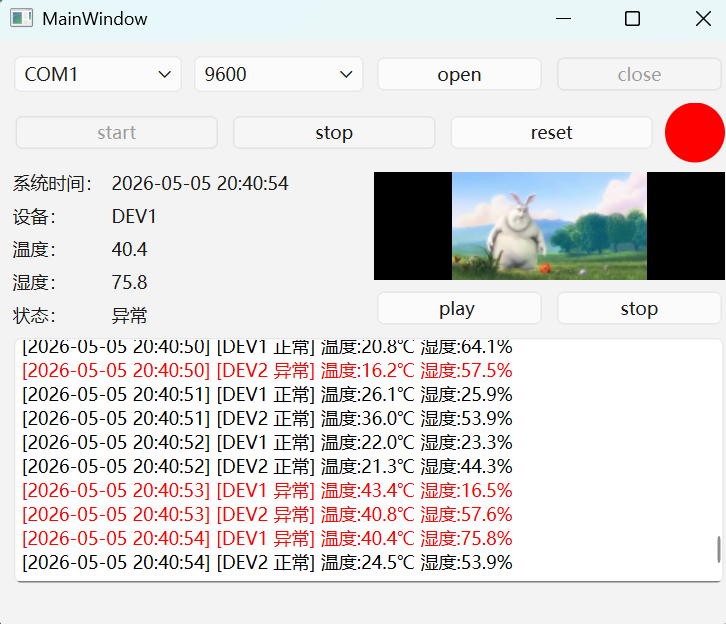
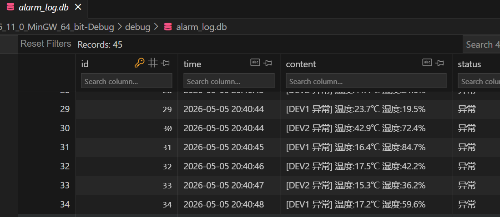

# Qt 多设备工控监控上位机 IndustrialMonitor

## 项目简介
基于 Qt 6 + FFmpeg 开发的工业设备监控上位机系统，支持多设备TCP网络接入、串口通信、实时温湿度数据采集、异常告警、视频联动监控、数据持久化全流程功能，解决了多设备数据刷新冲突、UI卡顿、设备离线检测等工业场景核心痛点。

## 核心功能
- **多设备TCP通信**：内置TCP服务器，支持多客户端并发接入，设备启停指令同步下发，温湿度数据实时接收解析。
- **串口通信**：串口自动扫描、参数配置、数据收发与日志打印，兼容主流串口设备。
- **视频监控模块**：深度集成FFmpeg实现完整视频播放链路，支持本地MP4文件与在线HTTP视频流的解封装、解码、格式转换全流程；自研多线程解码架构，将音视频解码与UI主线程完全解耦，杜绝界面卡顿；实现画面自适应缩放、宽高比锁定，保证播放画面清晰不变形，可直接适配工业监控场景的视频预览需求。
- **设备状态管理**：30秒无数据自动标记设备离线，温湿度阈值异常实时判断。
- **分级日志系统**：区分正常/异常/离线日志，支持异常数据SQLite数据库存储、CSV文件持久化导出。
- **UI交互优化**：解决多设备数据刷新过快、UI显示覆盖问题，界面布局自适应，操作流畅无卡顿。

## 技术栈
- 开发框架：Qt 6.x / Qt Widgets
- 编程语言：C++ 17
- 音视频处理：FFmpeg 7.1.1
- 数据库：SQLite3
- 通信协议：TCP/IP、串口通信
- 构建工具：qmake

## 运行截图

## excel截图

## 数据库截图

## 编译运行
### 环境依赖
1. Qt 6.x 及以上版本，安装时勾选对应编译器（MinGW / MSVC）
2. FFmpeg 7.1.1 开发库，已在pro文件中配置好路径
3. Windows 10/11 系统（Linux可跨平台适配）